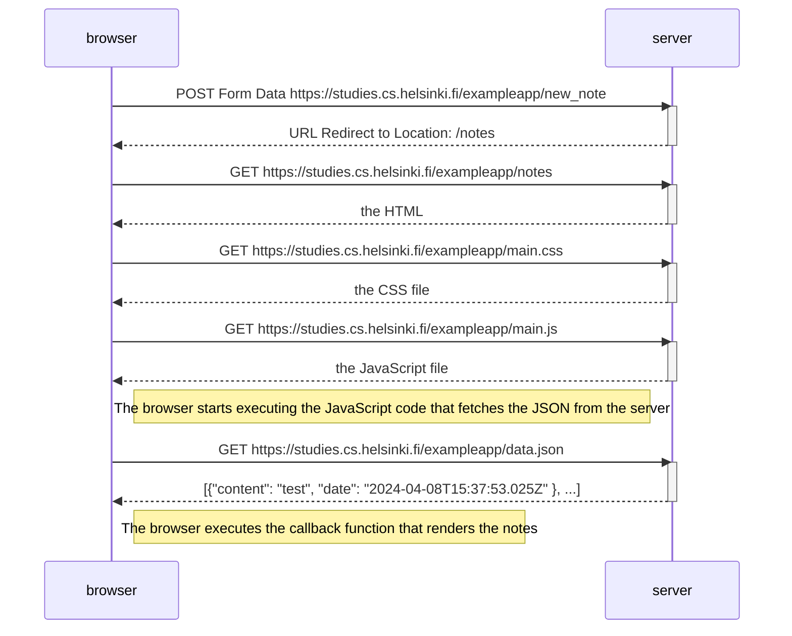
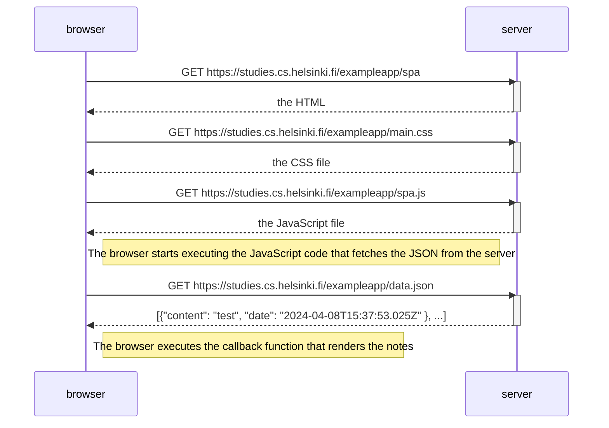
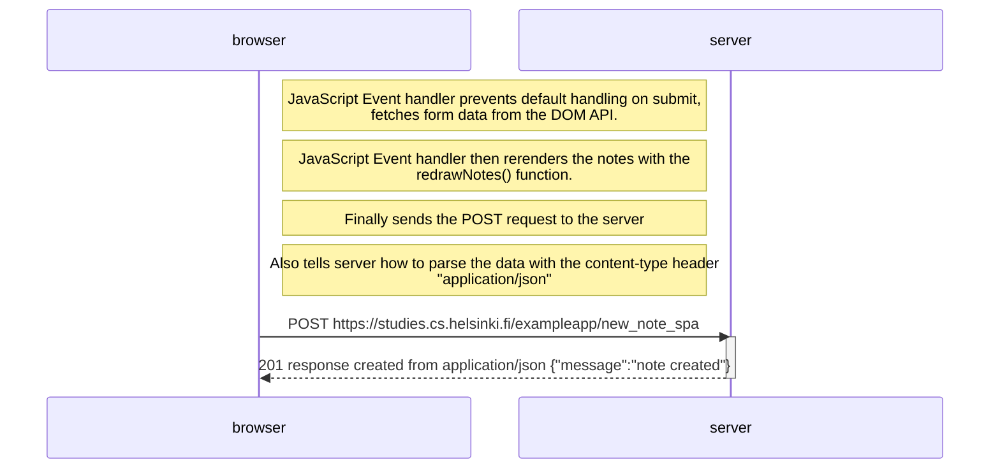

# part0
## New Note Diagram (exercise 0.4)

```mermaid
sequenceDiagram
    participant browser
    participant server

    browser->>server: POST Form Data https://studies.cs.helsinki.fi/exampleapp/new_note
    activate server
    server-->>browser: URL Redirect to Location: /notes
    deactivate server

    browser->>server: GET https://studies.cs.helsinki.fi/exampleapp/notes
    activate server
    server-->>browser: the HTML
    deactivate server

    browser->>server: GET https://studies.cs.helsinki.fi/exampleapp/main.css
    activate server
    server-->>browser: the CSS file
    deactivate server

    browser->>server: GET https://studies.cs.helsinki.fi/exampleapp/main.js
    activate server
    server-->>browser: the JavaScript file
    deactivate server

    Note right of browser: The browser starts executing the JavaScript code that fetches the JSON from the server

    browser->>server: GET https://studies.cs.helsinki.fi/exampleapp/data.json
    activate server
    server-->>browser: [{"content": "test", "date": "2024-04-08T15:37:53.025Z" }, ...]
    deactivate server

    Note right of browser: The browser executes the callback function that renders the notes
```

## Single Page App Diagram (exercise 0.5)

```mermaid
sequenceDiagram
    participant browser
    participant server

    browser->>server: GET https://studies.cs.helsinki.fi/exampleapp/spa
    activate server
    server-->>browser: the HTML
    deactivate server

    browser->>server: GET https://studies.cs.helsinki.fi/exampleapp/main.css
    activate server
    server-->>browser: the CSS file
    deactivate server

    browser->>server: GET https://studies.cs.helsinki.fi/exampleapp/spa.js
    activate server
    server-->>browser: the JavaScript file
    deactivate server
    
    Note right of browser: The browser starts executing the JavaScript code that fetches the JSON from the server

    browser->>server: GET https://studies.cs.helsinki.fi/exampleapp/data.json
    activate server
    server-->>browser: [{"content": "test", "date": "2024-04-08T15:37:53.025Z" }, ...]
    deactivate server

    Note right of browser: The browser executes the callback function that renders the notes
```

## New Note in SPA Diagram (exercise 0.6)

```mermaid
%%{init: { "sequence": { "wrap": true, "width":450 } } }%%
sequenceDiagram
    participant browser
    participant server

    Note right of browser: JavaScript Event handler prevents default handling on submit, fetches form data from the DOM API.
    Note right of browser: JavaScript Event handler then rerenders the notes with the redrawNotes() function.
    Note right of browser: Finally sends the POST request to the server
    Note right of browser: Also tells server how to parse the data with the content-type header "application/json"


    browser->>server: POST https://studies.cs.helsinki.fi/exampleapp/new_note_spa
    activate server
    server-->>browser: 201 response created from application/json {"message":"note created"}
    deactivate server
```
